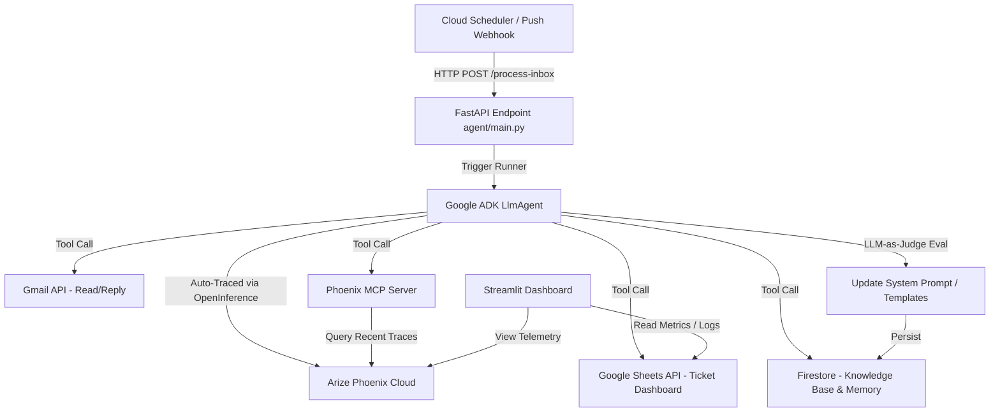

# Autonomous IT Support Inbox Guardian 🛡️📧

[](https://google.github.io/adk/)
[](https://phoenix.arize.com/)
[](https://opensource.org/licenses/Apache-2.0)
[](https://www.python.org/)

The **Autonomous IT Support Inbox Guardian** is a production-grade, 24/7 autonomous agent built using the **Google Agent Development Kit (ADK)** and integrated with **Arize Phoenix**. It owns a shared IT support mailbox, processing every incoming request, triaging issues, auto-resolving routine tickets, logging assignments, and continuously self-improving its response quality using LLM-as-Judge evals over its own runtime traces.

Unlike traditional chatbots that require manual user invocation within a chat widget, the **Inbox Guardian** runs proactively in the background, interacting where users naturally ask for help: the shared support inbox (`itsupport@yourcompany.com`).

---

## 📖 Table of Contents

1. [Features & Core Capabilities](#-features--core-capabilities)
2. [Hackathon Compliance Details (Arize & Google ADK)](#-hackathon-compliance-details)
3. [Architecture Overview](#-architecture-overview)
4. [Project Structure](#-project-structure)
5. [Installation & Setup](#-installation--setup)
6. [Local Testing in Simulated Mode (Sandbox)](#-local-testing-in-simulated-mode-sandbox)
7. [Production Live Deployment](#-production-live-deployment)
8. [License](#-license)

---

## ✨ Features & Core Capabilities

*   **Zero-User-Initiated Autonomy:** Runs autonomously on scheduled triggers (via Cloud Scheduler) or real-time webhooks, polling and processing tickets without manual intervention.
*   **Intelligent Triaging & Branching:** Reasons over the email subject, body, and historical knowledge base to categorize issues.
    *   *Routine issues* (e.g., password resets, printer setups) receive immediate auto-responses with links to knowledge base documents.
    *   *Complex issues* (e.g., hardware failures, system outages) are logged as tickets in Google Sheets/Firestore and escalated to human support via team notifications.
*   **Arize Phoenix Observability:** Captures and sends telemetry (prompts, tool calls, latencies) to Arize Phoenix Cloud using OpenTelemetry and OpenInference.
*   **Closed-Loop Self-Improvement:** Retrieves its own recent traces via the Arize Phoenix MCP (Model Context Protocol) server, evaluates them using an LLM-as-Judge evaluator, and dynamically adapts its response templates/rules.
*   **Live Streamlit Dashboard:** A unified control center to review metrics (total emails processed, average SLA, auto-resolution rates), audit logs, and an embedded Arize Phoenix telemetry iframe.

---

## 🏆 Hackathon Compliance Details

This project is built for the **Google Cloud Rapid Agent Hackathon** and qualifies for the **Arize Partner Track**.

### 1. Google Agent Development Kit (ADK) Integration
The core agent uses Google's official ADK. 
*   **`LlmAgent` Initialization:** Located in `agent/root_agent.py`, the agent uses the `gemini-2.5-pro` (or latest Gemini model) with structured instructions and schemas.
*   **Agent Tools:** Defined in `agent/tools.py` using the `@tool` decorator, equipping the agent with capabilities to read emails, reply to messages, write to Sheets, and consult Phoenix.
*   **ADK Runner:** Located in `agent/main.py`, invoking the agent lifecycle with `Runner(agent=inbox_guardian).run()`.

### 2. Arize Phoenix MCP & Tracing Integration
*   **Telemetry Instrumentation:** Configured in `agent/instrumentation.py` using `openinference-instrumentation-google-adk` and the standard OpenTelemetry SDK. Every execution step, latency, and tool invocation is traced and sent to the Arize Phoenix endpoint.
*   **Phoenix MCP Server:** Runs via `@arizeai/phoenix-mcp` to expose the agent's historical traces to the LLM during evaluation.
*   **Self-Improvement Loop:** The agent invokes `query_phoenix_traces` at the end of its cycle. It runs the LLM-as-Judge over its recent replies and updates its templates inside Firestore memory, visible inside the Streamlit dashboard.

---

## 🏗️ Architecture Overview



---

## 📂 Project Structure

```
it-support-inbox-guardian/
├── .gemini/                    # Phoenix MCP config (auto-created by CLI)
│   └── settings.json
├── agent/
│   ├── __init__.py
│   ├── main.py                 # FastAPI server & CLI entrypoint
│   ├── instrumentation.py      # Phoenix OpenTelemetry tracing setup
│   ├── root_agent.py           # Core LlmAgent declaration
│   ├── tools.py                # Gmail, Sheets, and Phoenix MCP tool functions
│   ├── prompts/
│   │   ├── system_prompt.txt   # Base triage & planning instructions
│   │   └── self_eval_prompt.txt # LLM-as-Judge grading criteria
│   └── dashboard/
│       └── app.py              # Streamlit management dashboard
├── deploy/
│   ├── cloud-run.yaml          # Google Cloud Run deployment configuration
│   └── scheduler-job.yaml      # Cloud Scheduler deployment configuration
├── docs/
│   └── submission_notes.md     # Hackathon video script & submission questionnaire
├── .env.example                # Sample environment variables
├── .gitignore
├── pyproject.toml              # UV / Pip project definition & dependencies
├── requirements.txt            # Fallback dependency file
└── Makefile                    # Make targets for linting, testing, and running
```

---

## ⚙️ Installation & Setup

### Prerequisites
*   Python 3.11 or higher.
*   An active Google Cloud Platform (GCP) account.
*   An Arize Phoenix Space API Key (obtain from [Arize Phoenix](https://app.phoenix.arize.com/)).

### 1. Clone the Repository
```bash
git clone https://github.com/Arize-ai/gemini-hackathon.git it-support-inbox-guardian
cd it-support-inbox-guardian
```

### 2. Install Dependencies
We recommend using **`uv`** for fast package management.

**Using `uv` (Recommended):**
```bash
# Install uv if not already installed
curl -LsSf https://astral.sh/uv/install.sh | sh

# Synchronize the environment
uv sync
```

**Using `pip`:**
```bash
pip install -r requirements.txt
```

### 3. Environment Configuration
Create a `.env` file in the root directory by copying the example file:
```bash
cp .env.example .env
```

Open `.env` and fill in the required keys:
```env
# Gemini LLM Keys
GEMINI_API_KEY=your_gemini_api_key

# Arize Phoenix Configurations
PHOENIX_API_KEY=px_live_...
PHOENIX_COLLECTOR_ENDPOINT=https://app.phoenix.arize.com/v1/traces

# Google Cloud Workspace Integrations
GOOGLE_SERVICE_ACCOUNT_JSON=configs/service-account.json
INBOX_EMAIL=itsupport@yourcompany.com
SHEET_ID=your_google_sheet_id_for_tickets
```

---

## 🧪 Local Testing in Simulated Mode (Sandbox)

To test the agent end-to-end without needing domain admin privileges or live Gmail permissions, the system includes a **Simulated Mode** that reads from and writes to mock files.

### 1. Verify Simulation Config
When `GOOGLE_SERVICE_ACCOUNT_JSON` is not provided or if `SIMULATE_MODE=True` is set in `.env`, the agent will:
*   Read mock emails from `data/mock_inbox.json`.
*   Append ticket records to `data/mock_sheets.json`.
*   Store knowledge-base and self-improvement state in `data/mock_db.json`.

### 2. Launch the Phoenix MCP Server
Run the local MCP server so the agent can inspect its execution traces:
```bash
npx @arizeai/phoenix-mcp --port 8000
```

### 3. Run the Agent Lifecycle
Trigger a single autonomous run of the agent via the CLI:
```bash
python -m agent.main
```
This command initializes the Google ADK Runner, processes all unread emails in the mock inbox, outputs the final action plans, logs metrics, and ships execution traces to your Phoenix dashboard.

### 4. Run the Streamlit Dashboard
View the live metrics and monitor agent activity in your browser:
```bash
streamlit run agent/dashboard/app.py
```
By default, the dashboard runs at `http://localhost:8501`. You can manually trigger runs, view the simulated ticket database, and watch the self-improvement evaluations update in real-time.

---

## 🚀 Production Live Deployment

Once the simulated runs pass your evaluations, deploy the agent to GCP.

### 1. Enable Domain-Wide Delegation (Admin Role)
To read/reply to support team emails:
1. Go to the **Google Cloud Console** and create a Service Account.
2. In the Google Workspace Admin Console, go to **Security > API Controls > Domain-Wide Delegation**.
3. Add a client ID for your service account and authorize the following OAuth Scopes:
   *   `https://mail.google.com/` (Send, read, and archive emails)
   *   `https://www.googleapis.com/auth/spreadsheets` (Update Sheets logs)
4. Download the service account JSON key file and reference it in `.env` as `GOOGLE_SERVICE_ACCOUNT_JSON`.

### 2. Deploy to Google Cloud Run
Deploy the FastAPI backend of the agent to Cloud Run:
```bash
gcloud run deploy inbox-guardian \
  --source . \
  --region us-central1 \
  --allow-unauthenticated \
  --set-env-vars PHOENIX_API_KEY=px_live_...,INBOX_EMAIL=itsupport@yourcompany.com,SHEET_ID=your_sheet_id \
  --service-account YOUR_SERVICE_ACCOUNT_EMAIL
```

### 3. Schedule the Cron Trigger
Create a Cloud Scheduler job to invoke the `/process-inbox` POST endpoint every 5 minutes:
```bash
gcloud scheduler jobs create http inbox-guardian-job \
  --schedule="*/5 * * * *" \
  --uri="https://inbox-guardian-xxx.a.run.app/process-inbox" \
  --http-method=POST \
  --description="Trigger Autonomous Support Triage"
```

---

## 📄 License

This project is licensed under the Apache License 2.0. See the `LICENSE` file for details.
