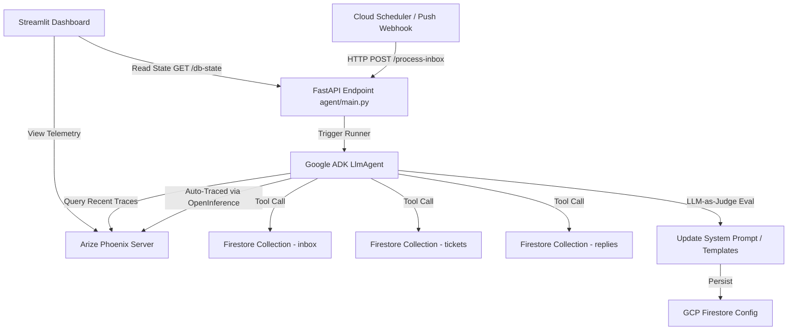

# Autonomous IT Support Inbox Guardian 🛡️📧

[](https://google.github.io/adk/)
[](https://phoenix.arize.com/)
[](https://opensource.org/licenses/Apache-2.0)
[](https://www.python.org/)

The **Autonomous IT Support Inbox Guardian** is a production-grade, 24/7 autonomous agent built using the **Google Agent Development Kit (ADK)** and integrated with **Arize Phoenix**. It owns a shared IT support mailbox, processing every incoming request, triaging issues, auto-resolving routine tickets, logging assignments, and continuously self-improving its response quality using LLM-as-Judge evals over its own runtime traces.

Unlike traditional chatbots that require manual user invocation within a chat widget, the **Inbox Guardian** runs proactively in the background, interacting where users naturally ask for help: the shared support inbox (`itsupport@yourcompany.com`).

---

## 📖 Table of Contents

1. [Features & Core Capabilities](#-features--core-capabilities)
2. [Hackathon Compliance Details (Arize & Google ADK)](#-hackathon-compliance-details)
3. [Architecture Overview](#-architecture-overview)
4. [Project Structure](#-project-structure)
5. [Installation & Setup](#-installation--setup)
6. [Local Testing in Simulated Mode (Sandbox)](#-local-testing-in-simulated-mode-sandbox)
7. [Production Live Deployment](#-production-live-deployment)
8. [License](#-license)

---

## ✨ Features & Core Capabilities

*   **Zero-User-Initiated Autonomy:** Runs autonomously on scheduled triggers (via Cloud Scheduler) or real-time webhooks, polling and processing tickets without manual intervention.
*   **Intelligent Triaging & Branching:** Reasons over the email subject, body, and historical knowledge base to categorize issues.
    *   *Routine issues* (e.g., password resets, printer setups) receive immediate auto-responses with links to knowledge base documents.
    *   *Complex issues* (e.g., hardware failures, system outages) are logged as tickets in native **Google Cloud Firestore** and escalated to human support.
*   **Arize Phoenix Observability:** Captures and sends telemetry (prompts, tool calls, latencies) to your self-hosted Arize Phoenix server on Cloud Run using OpenTelemetry and OpenInference.
*   **Closed-Loop Self-Improvement:** Retrieves its own recent traces via telemetry tools, evaluates them using an LLM-as-Judge evaluator, and dynamically adapts its response templates/rules.
*   **Live Streamlit Dashboard:** A unified control center to review metrics, inspect live Firestore database state, view replies, trigger runs, and monitor prompt optimization.

---

## 🏆 Hackathon Compliance Details

This project is built for the **Google Cloud Rapid Agent Hackathon** and qualifies for the **Arize Partner Track**.

### 1. Google Agent Development Kit (ADK) Integration
The core agent uses Google's official ADK. 
*   **`LlmAgent` Initialization:** Located in [root_agent.py](file:///c:/Users/kunal/OneDrive/Documents/Antigravity/RapidAgentHackathon/agent/root_agent.py), the agent uses Gemini models (such as `gemini-2.5-flash` or newer) with structured instructions and schemas.
*   **Agent Tools:** Defined in [tools.py](file:///c:/Users/kunal/OneDrive/Documents/Antigravity/RapidAgentHackathon/agent/tools.py) using the `@tool` decorator, equipping the agent with capabilities to read emails, reply to messages, write tickets, and consult traces.
*   **ADK Runner:** Located in [main.py](file:///c:/Users/kunal/OneDrive/Documents/Antigravity/RapidAgentHackathon/agent/main.py), invoking the agent lifecycle with `Runner(agent=inbox_guardian).run()`.

### 2. Arize Phoenix & Tracing Integration
*   **Telemetry Instrumentation:** Configured in [instrumentation.py](file:///c:/Users/kunal/OneDrive/Documents/Antigravity/RapidAgentHackathon/agent/instrumentation.py) using `openinference-instrumentation-google-adk` and the standard OpenTelemetry SDK. Every execution step, latency, and tool invocation is traced and sent to the Arize Phoenix collector endpoint.
*   **Self-Improvement Loop:** The agent invokes `query_phoenix_traces` at the end of its cycle. It runs the LLM-as-Judge over its recent replies and updates its templates inside Firestore memory, visible inside the Streamlit dashboard.

---

## 🏗️ Architecture Overview



---

## 📂 Project Structure

```
it-support-inbox-guardian/
├── agent/
│   ├── __init__.py
│   ├── main.py                 # FastAPI backend server
│   ├── instrumentation.py      # Phoenix OpenTelemetry tracing setup
│   ├── root_agent.py           # Core LlmAgent declaration
│   ├── tools.py                # Firestore-based inbox and ticket tools
│   ├── evaluators.py           # LLM-as-a-Judge and Self-Improvement logic
│   ├── prompts/
│   │   ├── system_prompt.txt   # Base triage & planning instructions
│   │   └── self_eval_prompt.txt # LLM-as-Judge grading criteria
│   └── dashboard/
│       └── app.py              # Streamlit management dashboard
├── deploy/
│   ├── cloud-run.yaml          # Google Cloud Run deployment configuration
│   └── scheduler-job.yaml      # Cloud Scheduler deployment configuration
├── docs/
│   └── submission_notes.md     # Hackathon video script & Devpost checklist
├── evaluations/
│   └── evaluation_report.md    # Unbiased submission evaluation report
├── .env.example                # Sample environment variables
├── .gitignore
├── pyproject.toml              # Project definition & dependencies
└── requirements.txt            # Fallback dependency file
```

---

## ⚙️ Installation & Setup

### Prerequisites
*   Python 3.11 or higher.
*   An active Google Cloud Platform (GCP) account with a Firestore Database instance (Native Mode).
*   A deployed or local Arize Phoenix instance.

### 1. Clone the Repository
```bash
git clone https://github.com/Arize-ai/gemini-hackathon.git it-support-inbox-guardian
cd it-support-inbox-guardian
```

### 2. Install Dependencies
We recommend using **`uv`** for fast package management.

**Using `uv` (Recommended):**
```bash
# Install uv if not already installed
curl -LsSf https://astral.sh/uv/install.sh | sh

# Synchronize the environment
uv sync
```

**Using `pip`:**
```bash
pip install -r requirements.txt
```

### 3. Environment Configuration
Create a `.env` file in the root directory by copying the example file:
```bash
cp .env.example .env
```

Open `.env` and fill in the required keys:
```env
# Gemini LLM Keys
GEMINI_API_KEY=your_gemini_api_key
GEMINI_MODEL=gemini-2.5-flash

# Arize Phoenix Configurations
PHOENIX_API_KEY=your_phoenix_api_key
PHOENIX_COLLECTOR_ENDPOINT=https://phoenix-server-xxx.run.app/v1/traces

# GCP Configuration
GCP_PROJECT_ID=your_gcp_project_id
FIRESTORE_DATABASE_ID=(default)

# Target email inbox for IT support tickets
INBOX_EMAIL=itsupport@yourcompany.com
```

---

## 🧪 Database Initialization & Local Testing

The project is fully integrated with **Google Cloud Firestore**, replacing local fallback files. Before running the agent, initialize and seed your Firestore database.

### 1. Run the FastAPI Backend Server
Start the Uvicorn web server:
```bash
python -m agent.main
```
The backend API runs on `http://localhost:8000`.

### 2. Reset and Seed the Database
Send a POST request to the `/db/reset` endpoint to purge existing Firestore collections (`inbox`, `replies`, `tickets`) and seed them with 10 default test support emails:
```bash
curl -X POST http://localhost:8000/db/reset
```
*(Alternatively, you can trigger this directly using the "Reset & Seed Database" control in the Streamlit UI dashboard).*

### 3. Run the Streamlit Dashboard
View the live metrics and monitor agent activity:
```bash
streamlit run agent/dashboard/app.py
```
By default, the dashboard runs at `http://localhost:8501`. Here you can manually enqueue custom test emails, trigger inbox triage cycles, inspect evaluation scores, and review the current prompt state.

---

## 🚀 Production Live Deployment

Deploy both the backend API and frontend Streamlit dashboard to Google Cloud Run.

### 1. Set Up Google Application Default Credentials (ADC)
Ensure the service account running the containers has the **Cloud Datastore User** (for Firestore) and **Vertex AI User** roles.

### 2. Deploy the FastAPI Backend
```bash
gcloud run deploy inbox-guardian-api \
  --source . \
  --region us-central1 \
  --allow-unauthenticated \
  --set-env-vars GCP_PROJECT_ID=your_project,GEMINI_API_KEY=your_key,PHOENIX_COLLECTOR_ENDPOINT=your_endpoint,INBOX_EMAIL=itsupport@yourcompany.com
```

### 3. Deploy the Streamlit UI
Build and deploy the frontend dashboard container:
```bash
gcloud run deploy inbox-guardian-ui \
  --source . \
  --region us-central1 \
  --allow-unauthenticated \
  --set-env-vars BACKEND_URL=https://inbox-guardian-api-xxx.a.run.app
```

### 4. Schedule the Cron Trigger
Create a Cloud Scheduler job to invoke the `/process-inbox` POST endpoint every 5 minutes to run the autonomous support cycle:
```bash
gcloud scheduler jobs create http inbox-guardian-job \
  --schedule="*/5 * * * *" \
  --uri="https://inbox-guardian-api-xxx.a.run.app/process-inbox" \
  --http-method=POST \
  --description="Trigger Autonomous Support Triage"
```

---

## 📄 License

This project is licensed under the Apache License 2.0. See the `LICENSE` file for details.
